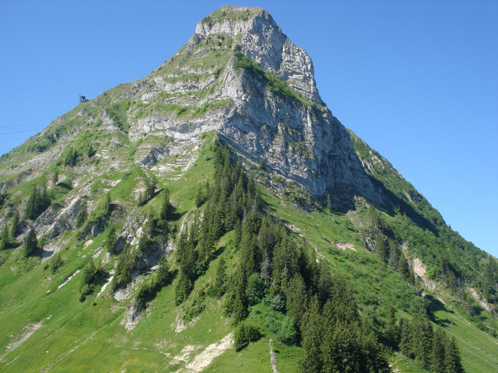

Pour s'amuser
#############

Sous-titre
==========

Sous-sous-titre
---------------

sous-sous-titre
---------------

Sous-titre-2
============

..  admonition:: Message

    Voici mon message

..  warning::

    Attention les amis

..  error::

    Ceci produit une erreur

..  note::

    Voici une petite note

Tableau
=======

.. csv-table:: Table Title
   :file: CSV file path and name
   :widths: 30, 70
   :header-rows: 1

   Prénom, Nom
   Guido, Van Rossum
   Alan, Turing
   Ada, Lovelace

.. csv-table:: Table Title
   :file: data/oci-4.csv
   :delim: ;
   :widths: 30, 70
   :header-rows: 1

Images
======

    La plus belle montagne du monde

Mathématiques
=============

On peut mettre des formules dans le texte : :math:`\sin^2(x) + \cos^2(x) = 1` 

..  math::

    \begin{equation}

    \end{equation}
    
..  raw:: html

    <iframe src="https://whatever.com/stuff.html">
    </iframe>

..  raw:: latex

    \section{N'importe quel \latex2e}

Inclure du code
===============

..  literalinclude:: scripts/factorial.py
    :pyobject: factorial
    :linenos:
    :emphasize-lines: 2-3, 6
    
    factorial.py